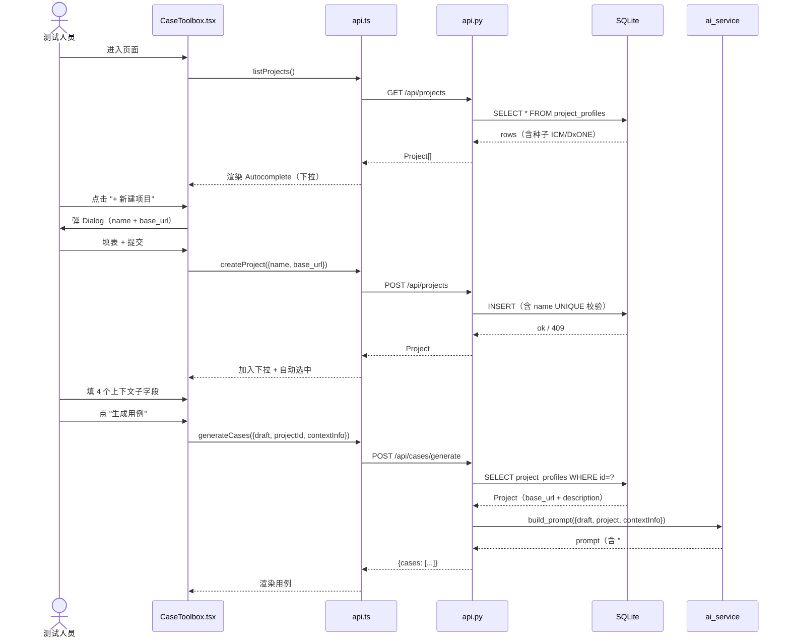

# ICM 增量架构设计 · 输入信息卡片改造

> 角色：高见远（架构师）
> 日期：2026-06-10
> 范围基线：[`icm-incremental-input-2026-06-10.md`](./icm-incremental-input-2026-06-10.md) v1.0
> 增量 PRD：[`incremental-input-PM-2026-06-10.md`](./incremental-input-PM-2026-06-10.md) v1.0
> 目标文件：`web-ui/src/pages/CaseToolbox.tsx`（5 字段顺序不动：项目 / 关联需求 / 上传 / 需求描述 / 上下文）

---

## 0. 关键决策一览（PM 3 个待确认问题已落定）

| # | 问题 | 决策 |
|---|---|---|
| 1 | 种子项目 `base_url` | 占位 `https://icm.example.com`，`description = "请在创建后修改"` |
| 2 | "+ 新建项目" Dialog 字段 | P0 只录 `name + base_url`；`description` 通过 PATCH 端点后续补，Dialog 不暴露 |
| 3 | 折叠状态记忆 | 不做 localStorage，每次默认展开（用组件内 `useState(true)`） |

---

## 1. 实现方案（数据流，1 段话）

用户在 Autocomplete 中**选择或新建项目** → 前端调 4 个 P0 端点维护 `project_profiles` 表（list/create/update/delete）→ 选中后 `projectId` 随用例草稿流转；用户填 4 个**上下文子字段** → 前端 `JSON.stringify` 后写入 `cases.spec_yaml` 顶层 `context_info`（TEXT, JSON 串, NULL 默认）→ `ai_service.generate_cases` 拼 prompt 时按段注入「## 项目信息」+「## 上下文信息」两段，**空字段/空段整段省略**，不污染 LLM 输入。

---

## 2. 技术选型（3 个决策点）

| 决策点 | 选型 | 理由 |
|---|---|---|
| **Autocomplete API** | MUI `<Autocomplete freeSolo={false} options={projects} getOptionLabel={p=>p.name}>` | 标准受控下拉，typed value 即 `Project` 对象；不开 `freeSolo` 避免用户手敲绕开选择（基线风险 3） |
| **JSON 序列化** | Python `json.dumps(..., ensure_ascii=False)` / 前端 `JSON.stringify` | 与既有 `spec_yaml` TEXT 存储惯例一致；中文不转义便于人工排查；空对象写 `null` 而非 `"{}"` |
| **prompt 模板扩展** | 分段函数 `_build_prompt_sections(blocks: list[Block])` ，`Block = {title, rows: [(k, v), ...]}` | 每段独立、空段整段丢弃；P2 新增字段只需加 1 个 Block，无侵入；与基线 P1「空字段不污染」直接对应 |

---

## 3. 数据模型（DDL）

### 3.1 `project_profiles`（P0 新增）

```sql
CREATE TABLE IF NOT EXISTS project_profiles (
    id          TEXT PRIMARY KEY,
    name        TEXT NOT NULL UNIQUE,
    base_url    TEXT,
    description TEXT,
    created_at  TEXT NOT NULL DEFAULT (datetime('now')),
    updated_at  TEXT NOT NULL DEFAULT (datetime('now'))
);

CREATE INDEX IF NOT EXISTS idx_project_profiles_name
    ON project_profiles(name);
```

**启动种子**（`SELECT COUNT(*)=0` 时插入 2 条）：

```sql
INSERT OR IGNORE INTO project_profiles (id, name, base_url, description) VALUES
    ('proj-icm-default',   'ICM',   'https://icm.example.com', '请在创建后修改'),
    ('proj-dxone-default', 'DxONE', 'https://icm.example.com', '请在创建后修改');
```

> `id` 选用 TEXT 与 `cases.id` 一致；前端不生成 ID，统一由后端 `uuid4().hex` 分配并返回。

### 3.2 `cases` 表（P1 决策 — 基线方案）

**不新增列**，复用 `spec_yaml` 顶层 `context_info`（TEXT, JSON 字符串, NULL 默认）。理由：
- 老数据 NULL 默认即可，**不迁移**（基线第 2 节「不在范围」）
- 与 `spec_yaml` 既有 "YAML/JSON 混存" 惯例一致
- 不破坏 P0/P1 既有功能（基线第 5 节风险 5）

---

## 4. 接口设计（P0 4 端点 / P1 0 端点）

| 方法 | 路径 | 入参 | 返回 | 错误码 |
|---|---|---|---|---|
| `GET`    | `/api/projects`      | — | `Project[]` | 200 |
| `POST`   | `/api/projects`      | `{name: str, base_url?: str, description?: str}` | `Project` | **200** / 400（name 缺失或空）/ **409**（name UNIQUE 冲突） |
| `PATCH`  | `/api/projects/{id}` | `{name?, base_url?, description?}` | `Project` | 200 / 404 / 409 |
| `DELETE` | `/api/projects/{id}` | — | `{ok: true}` | 200 / 404 |

```ts
type Project = {
  id: string;            // TEXT PK
  name: string;          // UNIQUE NOT NULL
  base_url: string | null;
  description: string | null;
  created_at: string;    // ISO 8601 UTC
  updated_at: string;    // ISO 8601 UTC
};

type ContextInfo = {
  env_url?: string;      // 环境URL
  test_account?: string; // 测试账号
  excluded?: string;     // 排除范围（多行）
  refs?: string;         // 参考文档
};
```

**P1 0 端点**：4 子字段随 `cases.spec_yaml` 持久化，不另开 API。
**name 重复**：前端 inline 去重 + 后端 409 双保险（基线第 5 节风险 3）。

---

## 5. 文件清单

| 文件 | 改/增 | 说明 |
|---|---|---|
| `icm_platform/db.py` | **改** | 加 `project_profiles` DDL + 启动种子 2 条（`SELECT COUNT` 判空） |
| `icm_platform/api.py` | **改** | 加 4 端点（GET/POST/PATCH/DELETE `/api/projects`）+ 409 冲突处理 |
| `icm_platform/ai_service.py` | **改** | prompt 拼装加 2 段：项目信息 + 上下文信息；空段/空字段整段省略 |
| `web-ui/src/data/api.ts` | **改** | 加 `Project` / `ContextInfo` 类型 + 4 包装：`listProjects` / `createProject` / `updateProject` / `deleteProject` |
| `web-ui/src/pages/CaseToolbox.tsx` | **改** | "所属项目" 改 Autocomplete + "+ 新建项目" Dialog；"上下文信息" 改 4 子字段 Stack（默认展开） |
| `icm_platform/tests/test_project_profiles.py` | **新** | 单测：DDL 幂等、4 端点、UNIQUE 409、404 删改、空表种子 2 条 |
| `icm_platform/tests/test_ai_prompt_context.py` | **新** | mock LLM：验 prompt 拼接（项目段、上下文段、空字段省略、空段整段不出现） |

---

## 6. 时序图 · 用户填项目 → LLM 生成用例



---

## 7. 任务列表（有序、含依赖、含估计行数）

| ID | 任务 | 文件 | 依赖 | 估计行数 | 优先级 |
|---|---|---|---|---|---|
| **T1** | `db.py` 加 `project_profiles` DDL + 启动种子 2 条 | `icm_platform/db.py` | — | ~30 | **P0** |
| **T2** | `api.py` 4 端点（GET/POST/PATCH/DELETE） | `icm_platform/api.py` | T1 | ~80 | **P0** |
| **T3** | `api.ts` 4 包装 + `Project` 类型 | `web-ui/src/data/api.ts` | T2 | ~25 | **P0** |
| **T4** | `CaseToolbox` 项目 Autocomplete + "+ 新建" Dialog | `web-ui/src/pages/CaseToolbox.tsx` | T3 | ~120 | **P0** |
| **T5** | `ai_service` prompt 注入 project 上下文段 | `icm_platform/ai_service.py` | T1 | ~25 | **P0** |
| **T6** | `CaseToolbox` 上下文 4 子字段（Stack，默认展开） | `web-ui/src/pages/CaseToolbox.tsx` | — | ~80 | **P1** |
| **T7** | `ai_service` prompt 注入 context_info 段（空字段省略） | `icm_platform/ai_service.py` | T6 | ~30 | **P1** |
| **T8** | `test_project_profiles` 单测 | `icm_platform/tests/test_project_profiles.py` | T2 | ~120 | **P0** |
| **T9** | `test_ai_prompt_context` 单测（mock LLM） | `icm_platform/tests/test_ai_prompt_context.py` | T5, T7 | ~80 | **P1** |
| **T10** | `npx tsc -b --noEmit` + 集成自测 | （无新代码） | T4, T6 | — | **P0** |

**关键依赖链**：

```
T1 ─┬─→ T2 ─→ T3 ─→ T4 ─┐
    └─→ T5                ├─→ T10
                          │
            T6 ─→ T7 ─→ T9 ←─ T5
                  └─→ T8 ← T2
```

---

## 8. 依赖包

**无新增**。`@mui/material@^5.14`（含 `<Autocomplete>`）、FastAPI、`json`/`uuid` 均为既有依赖。无需 `npm install` / `pip install`。

---

## 9. 共享知识（跨文件约定）

1. **项目 ID 类型**：`project_profiles.id` 用 **TEXT**，与 `cases.id` 一致；由后端 `uuid4().hex` 生成并返回，前端不生成
2. **JSON 序列化**：`context_info` 一律 `json.dumps(..., ensure_ascii=False)`（Python 端）+ `JSON.stringify`（前端）；读端对应 `json.loads` / `JSON.parse`；空对象写 `null` 而非 `"{}"`
3. **`projectId` 流转**：Autocomplete `onChange` 拿到完整 `Project` 对象 → 草稿 state 存 `projectId: string` → `generateCases` 请求体带 `projectId` → 后端按 id 查 `project_profiles` 注入 prompt（前端**不传** base_url/description，避免缓存过期）
4. **name 重复**：前端 inline 去重（`projects.find(p => p.name === input.trim())`）+ 后端 409 双保险
5. **折叠状态**：用组件内 `useState<boolean>(true)` 控展开，**不写 localStorage**
6. **5 字段顺序不动**：`项目 / 关联需求 / 上传 / 需求描述 / 上下文`（基线第 5 节风险 5）
7. **空字段约定**：4 子字段空字符串视为未填；拼 prompt 时整行省略；4 个全空时整段「## 上下文信息」不出现

---

## 10. 待明确事项

**无。** PM 3 个待确认问题已按本架构默认值（§0）推进；其余口径与基线 v1.0 完全一致，未越界。

---

> 文档版本：v1.0 · 2026-06-10 · 高见远
> 范围未越界：不写完整代码、不写测试代码、不新增 P2
