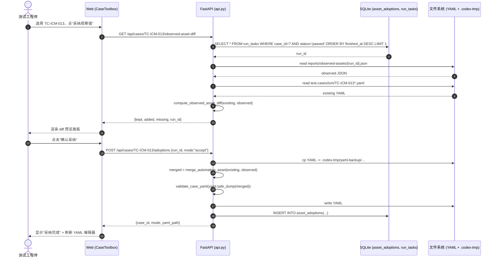
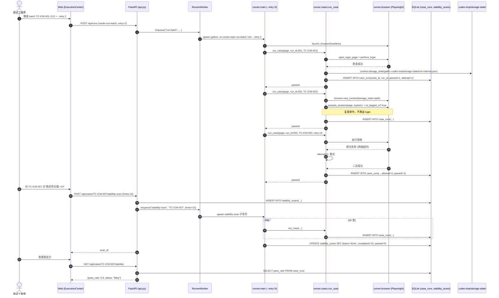
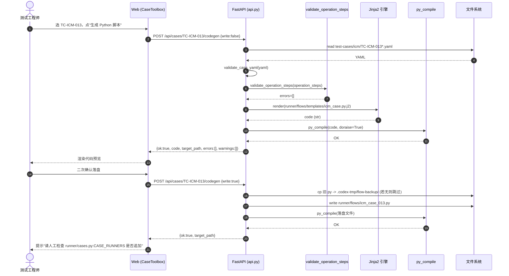

# ICM 自动化测试管理平台 · 增量架构设计

> 适用范围：`codex-chrome-smoke` 项目根目录
> 文档版本：v0.1（架构增量）
> 上游文档：`doc/icm-increment-prd.md`
> 路线：A 资产采纳 · B 登录复用 + 重试 + 稳定性 · C YAML → Python 模板化
> 作者：软件架构师（高见远）

---

## 1. 调研摘要（已实地验证）

下表所有"行号"均经 `Read` / `Grep` 工具核对，PRD §1 关键事实全部命中。

| 项 | 事实 | 证据 |
|---|---|---|
| 后端保守合并函数 | `merge_automation_asset(existing, observed) -> dict` 存在，conservative 语义"已有非空才保留" | `icm_platform/api.py:1271-1282` |
| 报告级合并 endpoint | `POST /api/runs/{run_id}/merge-observed-asset` 存在，仅按 run_id 操作 | `icm_platform/api.py:915-935` |
| 报告级 observed 读取 | `GET /api/runs/{run_id}/observed-asset` → `load_observed_asset_for_run` | `icm_platform/api.py:910, 1250` |
| 前端报告详情页合并按钮 | `ReportDetail.tsx:301` 已实现"合并为 verified automation_asset" + `canMergeObservedAsset`/`assetBusy`/`mergeObservedAsset` 状态机 | `web-ui/src/pages/ReportDetail.tsx:51,82,96,132,137,168,301-307` |
| 前端 api 包装 | `api.mergeObservedAsset(runId)` 已在 `data/api.ts:421` | `web-ui/src/data/api.ts:421` |
| runner 用例注册 | `CASE_RUNNERS` dict 在 `runner/cases.py:25-38`；`run_case()` 在 `:41-91` | `runner/cases.py:25,41` |
| runner CLI 入口 | `runner/main.py:parse_args` 在 `:28-36`，`main()` 在 `:62-100`，**无 `--retry`** | `runner/main.py:28,62` |
| 浏览器启动 | `launch_browser()` 在 `runner/browser.py:87-95`，**未设置 storage_state** | `runner/browser.py:87,93` |
| 登录入口 | `open_login_page` `:432`、`perform_login` `:483`、`ensure_logged_in` `:495`；每次 case 都重新走登录 | `runner/browser.py:432,483,495` |
| 通用 flow 工具 | `runner/flows/icm_common.py` 导出 `prepare_session`/`search_by_keyword`/`wait_for_table_row`/`wait_for_visible_dialog`/`click_dialog_primary`/`ensure_switch_enabled`/`ensure_fresh_login`/`settle` 等 | `runner/flows/icm_common.py:80-95` |
| 参考模板用例 | `icm_case_003.py` 全 19 行，仅 `prepare_session` + `open_device_list` + `fill` + `ensure_text_visible` | `runner/flows/icm_case_003.py:1-19` |
| observed 字段格式 | `AssetRecorder.to_asset()` 输出 `status/source/observed_at/evidence/operation_steps/selectors/input_values/assertions` | `runner/asset_recorder.py:45-59` |
| observed 落盘路径 | `reports/observed-assets/{run_id}.json`，落盘函数 `write_observed_asset` | `runner/asset_recorder.py:86-90` |
| SQLite 现状 | `case_runs` / `stability_scans` / `asset_adoptions` **均不存在**；现有 8 表（requirements/test_points/run_tasks/run_logs/ai_settings/case_drafts/report_analyses/report_analysis_versions/platform_settings） | `icm_platform/db.py:28-143`（grep 验证零命中） |
| `merge_strategy` 默认 | `"conservative"`（沿用既有策略） | `icm_platform/db.py:195` |
| retry / storageState / Jinja2 依赖 | 代码库零命中，无 `jinja2` 依赖 | grep `retry|storage_state` / grep `jinja2` 均为空 |
| 已有依赖 | `fastapi>=0.115`、`playwright>=1.40`、`pydantic>=2.8`、`PyYAML>=6.0`、`uvicorn[standard]>=0.30`（`pydantic` 已在用，无需新增） | `pyproject.toml:10-16` |
| `cases` 列表 endpoint | `GET /api/cases` → `list_cases()` | `icm_platform/api.py:222-224` + `icm_platform/assets.py:25-38` |
| 前端 api 列表 | `api.cases()` 在 `data/api.ts:332` | `web-ui/src/data/api.ts:332` |
| 临时目录 | `.codex-tmp/` 已存在但为空（PRD 已规划为 storageState / 备份目录） | `ls -la` 验证 |

---

## 2. 实现方案（按路线）

### 路线 A · 资产采纳主流程化

**A1 · 前端按钮位置**
- 在 `web-ui/src/pages/CaseToolbox.tsx` 的正式用例列表卡片（`CaseToolbox.tsx:156-174`）每行末尾追加"采纳观察值"按钮列。
- 按钮启用条件（前端态）：该 case 在 `case_runs`（路线 B 顺带）或 `run_tasks` 中存在 `status='passed'` 的最新单 case run，且 `observed-asset` JSON 可读。
- 复用 `ReportDetail.tsx:96-105` 的 `loadObservedAsset` 模式，但改为按 `case_id`（不是 `run_id`）拉取——为此需要新增"按 case 找最近 passed run"的 helper。

**A2 · Diff 预览**
- 新增 `GET /api/cases/{case_id}/observed-asset-diff`，实现位置：`icm_platform/api.py`，紧邻 `merge_run_observed_asset`（`:915` 之后）。
- 算法：取该 case 最新 `status='passed'` 且 `run_tasks.case_id` 匹配的 run → 加载 observed JSON → 加载当前 case YAML → 计算三段 diff：
  - **kept**：现有 `automation_asset` 中非空且与 observed 等价的字段子集
  - **added**：observed 独有但现有 YAML 缺失的字段
  - **missing**：observed 与现有 YAML 都没有，但 YAML 验证要求必须有的字段（如 `operation_steps` 为空时）
- 实现为纯函数 `compute_observed_asset_diff(existing_yaml: dict, observed: dict) -> dict`，**不写库**，便于单测。

**A3 · 采纳动作接入**
- 新增 `POST /api/cases/{case_id}/adoptions`，body `{run_id, mode: "accept"|"reject"}`。
- 复用 `merge_automation_asset()`（`api.py:1271`）做 conservative 合并；写回 YAML 前**先备份**到 `.codex-tmp/yaml-backup/{case_id}-{ts}.yaml`。
- 写 `asset_adoptions` 表（`mode=diff_summary_json`）。
- mode=`reject` 时不写 YAML，仅写 `asset_adoptions`，保留证据（满足 US-A5）。

**A4 · 后端 `merge_automation_asset` 是否需改？**
- PRD §9 风险 #1 提到"草稿阶段 operation_steps 为空时会被 observed 直接填充"。
- **建议不改函数本体**，而是在 endpoint 层新增策略开关：当 `case_drafts.promoted_path IS NULL` 时走 strict 模式（仅当 `existing` 完全为空才填入）。判定位置：`api.py` 新 endpoint 内，调用合并函数前判断。
- 这样既不破坏 `ReportDetail.tsx:301` 现有行为（仍走 conservative），又给"草稿 → 正式"流程留出严格通道。

### 路线 B · 登录复用 + 重试 + 稳定性

**B1 · Retry 入口**
- 在 `runner/cases.py:run_case()` 内部包一层 retry 循环（**而非 CLI 层**）：
  - 理由：CLI 层只能判 return code，但 Playwright 内部 exception 才是我们要 retry 的目标；`run_case` 已经 try/except。
- 改造点：`runner/cases.py:59-66` 的 `try` 块改为 `for attempt in range(1, retry + 2):`；首次失败后清空 `page` 状态（`page.goto("about:blank")` + `context.clear_cookies()` 可选）再重试；最后一次失败才记 `status="failed"`。
- CLI 入口新增 `--retry N`：`runner/main.py:parse_args`（`:28-36`）新增 `parser.add_argument("--retry", type=int, default=0)`；`run_case()` 调用处传入。
- Worker 透传：`icm_platform/worker.py:_runner_args`（`:124-133`）扩展 `--retry`；`enqueue`（`:27-51`）中 `command_parts` 同步追加。

**B2 · storageState 落盘**
- 修改 `runner/browser.py:launch_browser`（`:87-95`）：
  - batch 入口先创建 `storage_state_path = ROOT/.codex-tmp/storage-state/{system_id}.json`，目录已在（验证通过）。
  - 首次 launch 不传 `storage_state`；登录成功后调 `await context.storage_state(path=...)` 落盘。
  - 后续 case 在 `runner/cases.py:run_case` 进入前，若 `storage_state_path.exists()`，调用 `await browser.new_context(storage_state=str(path), ...)` 替换 context。
- 失效判定：登录后访问受保护页面 → `is_logged_in()` 返回 false（`browser.py:460-474`）→ 走 fallback `perform_login()` 并重新落盘。
- Fallback 入口：把 `run_case` 中 `await open_login_page(page, system)` 后追加 `await ensure_logged_in(page, system)` 兼容已有行为；batch 入口前增加 `load_or_create_login_session()` 函数。

**B3 · `case_runs` 表**
- DDL 见 §4。落库点：`runner/cases.py:run_case` 在 finally（`:66-76`）之后，记录 `{case_id, run_id, passed(0/1), started_at, finished_at, attempt}`。
- 同步把 retry 次数写入 `attempt` 字段（首次=1，retry=2…）。

**B4 · `GET /api/cases/{case_id}/stability`**
- 实现位置：`icm_platform/api.py` 新增 endpoint。
- 算法：`SELECT passed, COUNT(*) FROM case_runs WHERE case_id=?` → `{total, passed, pass_rate, status, last_stable_at}`；阈值默认 0.95（来自 `platform_settings.runner.stability_threshold`，P1 配置项）。
- `status` 判定：`total < 5` → `insufficient`；`pass_rate >= 0.95` → `stable`；否则 `flaky`。
- 索引：在 `case_runs(case_id, passed)` 上建复合索引（见 §4）。

**B5 · stability-scan 子命令**
- 新增 CLI：`python -m runner.main stability-scan <case_id> [--times 10]`，由 `RunnerWorker.enqueue(mode="stability-scan", case_id=...)` 入队。
- 在 `worker.py:_loop` 增加分支；runner 内部循环 `times` 次调用 `run_case()`，结果全写 `case_runs`，并写 `stability_scans`。
- 进度查询：`GET /api/stability-scans/{scan_id}` 返回 `{id, status, completed, passed, total}`。

**B6 · 前端稳定分徽标**
- 在 `CaseToolbox.tsx:156-174` 的 table thead 新增"稳定分"列（在"脚本"前）；列渲染规则：
  - `pass_rate >= 0.95` → 绿色 pill
  - `0.8 <= pass_rate < 0.95` → 黄色 pill
  - `pass_rate < 0.8` → 红色 pill
  - `insufficient` → 灰色 pill + 文案"样本不足"
- 数据源：`api.cases({include_stability: true})`（扩展现有 `GET /api/cases` endpoint）。

### 路线 C · YAML → Python 模板化

**C1 · 模板路径与参照**
- 新建 `runner/flows/templates/icm_case.py.j2`（**新建目录**）。
- 模板变量：`{case_id, title, system_id, operation_steps, selectors, input_values, assertions}`。
- 函数骨架（基于 `icm_case_003.py:1-19`）：
  - `import` 段：从 `runner.browser` 取 `open_*` 系列；从 `runner.flows.icm_common` 取 `prepare_session`/`search_by_keyword`/`wait_for_table_row`/`wait_for_visible_dialog`/`click_dialog_primary`/`ensure_switch_enabled`/`ensure_fresh_login`/`settle`。
  - `async def run(page, system, case)`：先 `await prepare_session(page, system)`，再按 `operation_steps` 关键词派发到对应工具函数。

**C2 · 关键词匹配 vs 强制预规范**
- PRD §9 风险 #5 提到描述风格不统一。
- **采用"关键词匹配 + 强制预规范"双轨**：
  - 关键词正则清单（在模板里 hardcode）：
    - `r"登录|login"` → `await prepare_session(page, system)`
    - `r"打开|open|navigate|访问"` + 路由名 → `await open_{route}(page, system)`
    - `r"搜索|查询|query|keyword"` → `await search_by_keyword(page, sel, kw)`
    - `r"点击|click"` → `await click_first(page, sel)`
    - `r"输入|填写|fill|enter"` → `await fill_first(page, sel, value)`
    - `r"断言|assert|verify|确认"` → `await ensure_text_visible(page, text)` 或自定义断言
  - 强制预规范：codegen endpoint 收到 `operation_steps` 后先调用 `validate_operation_steps()`，命中不了的步骤返回 `errors: ["unsupported step kind: {raw}"]`，**禁止落盘**（满足 PRD §10 验收 #11）。

**C3 · `POST /api/cases/{case_id}/codegen`**
- 实现位置：`icm_platform/api.py` 新增 endpoint，紧邻 promote 流程（`:850` 附近）。
- 入参：`CodegenRequest {write: bool, template: "functional"|"negative"|"regression"="functional"}`。
- Dry-run 流程：
  1. 加载 case YAML（`find_case_yaml` `api.py:1263`）
  2. 校验 `operation_steps`/`selectors`/`input_values`/`assertions` 非空（`validate_case_yaml` `api.py:1285`）
  3. `validate_operation_steps()`：遍历 `operation_steps`，未命中关键词的步骤进 `errors`
  4. 渲染 Jinja2 模板到内存字符串（**不写盘**）
  5. 用 `py_compile.compile(code, doraise=True)` 自检语法（满足 PRD §8 安全沙箱）
  6. 返回 `{ok, code, target_path, errors, warnings}`
- 落盘流程（`write=True`）：
  1. 备份旧文件到 `.codex-tmp/flow-backup/{case_id}-{ts}.py`（首次生成时跳过）
  2. 写入 `runner/flows/icm_case_XXX.py`
  3. 再次 `py_compile` 落盘文件
  4. 返回成功 + 提示人工检查 `runner/cases.py:CASE_RUNNERS` 是否需要追加新条目（**自动追加 P1 + 人工最终确认**；P0 仅生成 + 提示，不自动改 `cases.py`）

---

## 3. 文件清单（精确到行）

### 3.1 新建文件

| 路径 | 作用 | 关联路线 |
|---|---|---|
| `runner/flows/templates/__init__.py` | 新建包，模板包内 | C |
| `runner/flows/templates/icm_case.py.j2` | Jinja2 Python flow 模板 | C |
| `.codex-tmp/storage-state/`（目录） | storageState 落盘 | B |
| `.codex-tmp/yaml-backup/`（目录） | YAML 采纳前备份 | A |
| `.codex-tmp/flow-backup/`（目录） | codegen 落盘前备份 | C |
| `icm_platform/tests/test_adoptions.py` | 采纳逻辑单测 | A |
| `icm_platform/tests/test_stability.py` | 稳定分/stability-scan 单测 | B |
| `icm_platform/tests/test_codegen.py` | 模板渲染/py_compile 自检单测 | C |

### 3.2 修改文件

| 路径 | 改动点（行号 / 函数） | 关联路线 |
|---|---|---|
| `icm_platform/db.py` | `init_db()`（`:28-143`）追加 3 表 DDL：`case_runs` / `asset_adoptions` / `stability_scans` | A+B |
| `icm_platform/api.py` | 新增 endpoint：`GET /api/cases/{case_id}/observed-asset-diff`（紧邻 `:915`） | A |
| `icm_platform/api.py` | 新增 `POST /api/cases/{case_id}/adoptions`（紧邻 `:915`） | A |
| `icm_platform/api.py` | 新增 `GET /api/cases/{case_id}/adoptions?limit=10` | A |
| `icm_platform/api.py` | 新增 `GET /api/cases/{case_id}/stability` | B |
| `icm_platform/api.py` | 新增 `POST /api/cases/{case_id}/stability-scan` | B |
| `icm_platform/api.py` | 新增 `GET /api/stability-scans/{scan_id}` | B |
| `icm_platform/api.py` | `GET /api/cases`（`:222`）扩展 query `include_stability` | B |
| `icm_platform/api.py` | 新增 `POST /api/cases/{case_id}/codegen` | C |
| `icm_platform/api.py` | 新增 `merge_observed_asset_diff()` 纯函数（紧邻 `:1271`） | A |
| `icm_platform/worker.py` | `_runner_args`（`:124-133`）扩展 `--retry`、`--no-storage-state`；`enqueue`（`:27-51`）透传；`_loop`（`:53-59`）新增 stability-scan 分支 | B |
| `runner/main.py` | `parse_args`（`:28-36`）新增 `--retry`/`--no-storage-state`；`main()`（`:62-100`）新增 `stability-scan` 命令分支；`run_case` 调用（`:76, 88`）传入 retry + storage_state path | B |
| `runner/cases.py` | `run_case`（`:41-91`）retry 循环；call storageState helper；落 `case_runs` | B |
| `runner/browser.py` | `launch_browser`（`:87-95`）接受 `storage_state_path`；新增 `load_or_create_login_session()` 函数；`run_case` 入口前用 helper | B |
| `runner/asset_recorder.py` | 无改动（落盘格式已对齐） | — |
| `web-ui/src/pages/CaseToolbox.tsx` | 列表加稳定分列 + 采纳按钮（`:156-174`）；主区加 diff 预览卡片（紧邻 `:190`）；主区加 codegen 卡片（紧邻 `:264`） | A+B+C |
| `web-ui/src/pages/ExecutionCenter.tsx` | batch 跑完加"采纳全部"按钮 | A |
| `web-ui/src/pages/SystemSettings.tsx` | 加"稳定性阈值"输入 + "启用 storageState 复用"开关 | B |
| `web-ui/src/data/api.ts` | 新增：`observedAssetDiff`、`acceptObservedAsset`、`rejectObservedAsset`、`adoptions`、`caseStability`、`startStabilityScan`、`stabilityScanStatus`、`caseCodegen`、`cases({include_stability:true})` | A+B+C |
| `pyproject.toml` | `dependencies` 追加 `jinja2>=3.1`（C 路线）；其余不变 | C |
| `.gitignore`（新建） | 加入 `.codex-tmp/`、`reports/observed-assets/`、`platform-data/*.sqlite3` | B |

---

## 4. 数据结构与接口

### 4.1 新增表 DDL

```sql
-- 路线 B：每次执行落库
create table if not exists case_runs (
  id integer primary key autoincrement,
  case_id text not null,
  run_id text not null,
  passed integer not null,            -- 0/1
  started_at text not null,
  finished_at text not null,
  attempt integer default 1,
  retry_exhausted integer default 0,  -- 0/1，最后一次 attempt 仍失败
  foreign key(run_id) references run_tasks(id)
);
create index if not exists idx_case_runs_case_id on case_runs(case_id);
create index if not exists idx_case_runs_passed on case_runs(case_id, passed);
create index if not exists idx_case_runs_started on case_runs(case_id, started_at desc);

-- 路线 A：采纳历史
create table if not exists asset_adoptions (
  id integer primary key autoincrement,
  case_id text not null,
  run_id text not null,
  mode text not null,                  -- 'accept' | 'reject'
  diff_summary_json text,              -- {kept: N, added: N, missing: N}
  adopted_by text,                     -- 见 PRD §9 风险 #7，可空
  adopted_at text not null
);
create index if not exists idx_asset_adoptions_case on asset_adoptions(case_id, adopted_at desc);

-- 路线 B：稳定性扫描任务
create table if not exists stability_scans (
  id text primary key,
  case_id text not null,
  total integer not null,
  completed integer default 0,
  passed integer default 0,
  status text not null,                -- 'queued'|'running'|'done'|'failed'
  threshold real default 0.95,
  started_at text not null,
  finished_at text
);
create index if not exists idx_stability_scans_case on stability_scans(case_id, started_at desc);
```

迁移策略：**手工 ALTER**（与现有 `ensure_column` 模式一致；引入 alembic 对当前 8 表规模是过度工程，详见 §8）。

### 4.2 新增/修改 API endpoint

| Method | Path | 入参 | 出参 | 路线 | 复用 |
|---|---|---|---|---|---|
| GET | `/api/cases/{case_id}/observed-asset-diff` | path: case_id | `{case_id, run_id, diff:{kept:[], added:[], missing:[]}, generated_at}` | A | `merge_automation_asset` 复用为算法基底 |
| POST | `/api/cases/{case_id}/adoptions` | `{run_id:str, mode:"accept"\|"reject", adopted_by?:str}` | `{case_id, run_id, mode, diff_summary, yaml_path?}` | A | `merge_automation_asset` + `validate_case_yaml` |
| GET | `/api/cases/{case_id}/adoptions?limit=10` | path + query | `[{case_id, run_id, mode, adopted_by, adopted_at, diff_summary}]` | A | — |
| GET | `/api/cases/{case_id}/stability` | path | `{case_id, total, passed, pass_rate, status, last_stable_at, threshold}` | B | 派生自 `case_runs` |
| POST | `/api/cases/{case_id}/stability-scan` | `{times:int=10, threshold?:float=0.95}` | `{scan_id, status:"queued"}` | B | `RunnerWorker.enqueue` |
| GET | `/api/stability-scans/{scan_id}` | path | `{scan_id, case_id, total, completed, passed, status, threshold, started_at, finished_at?}` | B | — |
| GET | `/api/cases?include_stability=true` | query | `[{...ApiCase, stability?}]`（扩展原 `ApiCase` schema） | B | `list_cases()` + 联表 `case_runs` |
| POST | `/api/cases/{case_id}/codegen` | `{write:bool=false, template:"functional"\|"negative"\|"regression"="functional"}` | `{ok, code, target_path, errors, warnings}` | C | Jinja2 + `py_compile` |

---

## 5. 时序图

### 路线 A · 采纳观察值时序



### 路线 B · 登录复用 + 重试 + 稳定性扫描时序



### 路线 C · codegen 时序



---

## 6. 任务列表

> 共 **14 个任务**，按"先调研后实现、先数据后 UI、先 A 后 B 后 C"的顺序编号。
> 总工作量估算：**约 12.5 人·天**（按 1 人独立完成）。

### 路线 A · 资产采纳主流程化

#### T1 · 新增 3 张 SQLite 表 DDL（`case_runs` / `asset_adoptions` / `stability_scans`）
- **路线**：A + B 共用前置
- **依赖**：—
- **涉及文件**：`C:\Users\FQ1017\Documents\ICM\codex-chrome-smoke\icm_platform\db.py`（`init_db` `:28-143`）
- **验收**：
  - `python -c "from icm_platform.db import init_db; init_db()"` 后 `.schema case_runs` 输出含 §4.1 字段
  - 重启进程后旧数据保留（兼容测试）
- **工作量**：0.5d

#### T2 · 后端：实现 `GET /api/cases/{case_id}/observed-asset-diff`
- **路线**：A
- **依赖**：T1
- **涉及文件**：`C:\Users\FQ1017\Documents\ICM\codex-chrome-smoke\icm_platform\api.py`（紧邻 `:915`）
- **验收**：
  - Given 一条 passed run + 现有 YAML；When GET；Then 返回 `{kept, added, missing}` 三段均非空（手工 mock 单测）
  - 现有 YAML `operation_steps` 为空时，`added` 含 observed 的全部步骤，`missing` 列表为空
- **工作量**：1d

#### T3 · 后端：实现 `POST /api/cases/{case_id}/adoptions` + `GET /api/cases/{case_id}/adoptions`
- **路线**：A
- **依赖**：T1, T2
- **涉及文件**：`C:\Users\FQ1017\Documents\ICM\codex-chrome-smoke\icm_platform\api.py`
- **验收**：
  - Given mode=`accept`；When POST；Then YAML 内 `automation_asset.source` = `playwright_observed`，原 `selectors`/`input_values` 不变（沿用 `merge_automation_asset` conservative 语义）
  - Given mode=`reject`；When POST；Then YAML 不动、`asset_adoptions` 新增 1 行 `mode='reject'`
  - Given 落盘前；Then `.codex-tmp/yaml-backup/{case_id}-{ts}.yaml` 已生成
- **工作量**：1.5d（含单测）

#### T4 · 前端：CaseToolbox 采纳按钮 + diff 预览面板 + 采纳历史展示
- **路线**：A
- **依赖**：T2, T3
- **涉及文件**：
  - `C:\Users\FQ1017\Documents\ICM\codex-chrome-smoke\web-ui\src\pages\CaseToolbox.tsx`（列表 `:156-174`，主区紧邻 `:190`）
  - `C:\Users\FQ1017\Documents\ICM\codex-chrome-smoke\web-ui\src\data\api.ts`（紧邻 `:421`）
- **验收**：
  - 列表每行有"采纳观察值"按钮，按钮态由最新 run 的 `status='passed'` 决定
  - 点击按钮展开 diff 预览（kept/added/missing 三段）
  - 二次确认后落盘，刷新列表显示"上次采纳时间"
- **工作量**：1.5d

### 路线 B · 登录复用 + 重试 + 稳定性

#### T5 · runner：`--retry N` CLI + `run_case` retry 循环 + `case_runs` 落库
- **路线**：B
- **依赖**：T1
- **涉及文件**：
  - `C:\Users\FQ1017\Documents\ICM\codex-chrome-smoke\runner\main.py`（`parse_args` `:28-36`，`main` `:62-100`）
  - `C:\Users\FQ1017\Documents\ICM\codex-chrome-smoke\runner\cases.py`（`run_case` `:41-91`）
  - `C:\Users\FQ1017\Documents\ICM\codex-chrome-smoke\icm_platform\worker.py`（`_runner_args` `:124-133`）
- **验收**：
  - `--retry 2` + mock 网络超时 → 首次 failed → 重试 2 次 → 任一成功则 case passed
  - `run_logs` 含 `retry exhausted` 行（仅全部失败时）
  - `case_runs` 新增行 `attempt` 字段值随重试递增
- **工作量**：1.5d

#### T6 · runner/browser：`storage_state` 落盘与读取 + 失败回退登录
- **路线**：B
- **依赖**：T5
- **涉及文件**：
  - `C:\Users\FQ1017\Documents\ICM\codex-chrome-smoke\runner\browser.py`（`launch_browser` `:87-95`，新增 `load_or_create_login_session`）
  - `C:\Users\FQ1017\Documents\ICM\codex-chrome-smoke\runner\cases.py`（`run_case` 入口前）
- **验收**：
  - batch 跑第一条用例后 `.codex-tmp/storage-state/icm-internal.json` 存在
  - 第二条用例 `prepare_session` 平均耗时 < 1s（日志可见）
  - storageState 失效（删除文件后重跑）→ 自动 fallback `perform_login` 并重新落盘
- **工作量**：1.5d

#### T7 · 后端：`GET /api/cases/{case_id}/stability` + `?include_stability=true` 扩展
- **路线**：B
- **依赖**：T1
- **涉及文件**：`C:\Users\FQ1017\Documents\ICM\codex-chrome-smoke\icm_platform\api.py`（`cases` `:222`，新增 stability endpoint）
- **验收**：
  - Given `case_runs` 8 passed / 10 total；When GET；Then 返回 `{pass_rate: 0.8, status: "flaky"}`
  - Given total < 5；When GET；Then `status: "insufficient"`
  - 扩展 `GET /api/cases?include_stability=true` 返回 `{...ApiCase, stability}`
- **工作量**：0.5d

#### T8 · 后端 + runner：stability-scan 子命令 + Worker 入队
- **路线**：B
- **依赖**：T1, T5, T6
- **涉及文件**：
  - `C:\Users\FQ1017\Documents\ICM\codex-chrome-smoke\icm_platform\api.py`（新增 stability-scan endpoint）
  - `C:\Users\FQ1017\Documents\ICM\codex-chrome-smoke\icm_platform\worker.py`（`_loop` `:53-59` 新增分支）
  - `C:\Users\FQ1017\Documents\ICM\codex-chrome-smoke\runner\main.py`（新增 `stability-scan` 命令分支）
- **验收**：
  - `POST /api/cases/{id}/stability-scan {times:10}` 返回 `{scan_id, status:"queued"}`
  - 10 次执行完毕，`stability_scans.status='done'`、`case_runs` 新增 10 行
  - `GET /api/stability-scans/{scan_id}` 返回进度
- **工作量**：1.5d

#### T9 · 前端：CaseToolbox 稳定分徽标 + ExecutionCenter 采纳全部按钮 + SystemSettings 阈值开关
- **路线**：B
- **依赖**：T7, T8
- **涉及文件**：
  - `C:\Users\FQ1017\Documents\ICM\codex-chrome-smoke\web-ui\src\pages\CaseToolbox.tsx`（列表 `:156-174`）
  - `C:\Users\FQ1017\Documents\ICM\codex-chrome-smoke\web-ui\src\pages\ExecutionCenter.tsx`
  - `C:\Users\FQ1017\Documents\ICM\codex-chrome-smoke\web-ui\src\pages\SystemSettings.tsx`
  - `C:\Users\FQ1017\Documents\ICM\codex-chrome-smoke\web-ui\src\data\api.ts`
- **验收**：
  - 列表新增"稳定分"列，颜色 pill 与 PRD §5 一致
  - 鼠标悬停显示"passed/total · last_stable_at"
  - SystemSettings 新增阈值输入（默认 0.95）和 storageState 开关
- **工作量**：1d

### 路线 C · YAML → Python 模板化

#### T10 · 引入 Jinja2 + 新建模板 `runner/flows/templates/icm_case.py.j2`
- **路线**：C
- **依赖**：—
- **涉及文件**：
  - `C:\Users\FQ1017\Documents\ICM\codex-chrome-smoke\pyproject.toml`（`dependencies` 追加 `jinja2>=3.1`）
  - `C:\Users\FQ1017\Documents\ICM\codex-chrome-smoke\runner\flows\templates\__init__.py`（新建）
  - `C:\Users\FQ1017\Documents\ICM\codex-chrome-smoke\runner\flows\templates\icm_case.py.j2`（新建）
- **验收**：
  - `pip install -e .` 后 `import jinja2` 成功
  - 用 `icm_case_003.py:1-19` 的 6 步硬编码到模板后，`code` 输出含 `prepare_session` / `open_device_list` / `fill_first` / `ensure_text_visible` 调用
- **工作量**：1d

#### T11 · 后端：实现 `POST /api/cases/{case_id}/codegen`（dry-run + 落盘）
- **路线**：C
- **依赖**：T10
- **涉及文件**：`C:\Users\FQ1017\Documents\ICM\codex-chrome-smoke\icm_platform\api.py`
- **验收**：
  - Given `operation_steps` 含 6 步均命中关键词；When `write=false`；Then 返回 `{ok:true, code, target_path, errors:[]}`
  - Given `write=true` + 二次确认；When 落盘；Then `.codex-tmp/flow-backup/{case_id}-{ts}.py` 已生成 + `runner/flows/icm_case_XXX.py` 已写
  - Given `operation_steps` 为空；When codegen；Then 返回 `{ok:false, errors:["missing operation_steps"]}`
- **工作量**：1.5d

#### T12 · 后端：codegen 内置 `py_compile` 自检
- **路线**：C
- **依赖**：T11
- **涉及文件**：`C:\Users\FQ1017\Documents\ICM\codex-chrome-smoke\icm_platform\api.py`（codegen endpoint 内）
- **验收**：
  - 模板渲染失败（语法错）→ 返回 `{ok:false, errors:["py_compile failed: ..."]}`
  - 落盘后再编译落盘文件 → 若失败回滚（删除刚写入的 .py）
- **工作量**：0.5d（嵌入 T11）

#### T13 · 前端：CaseToolbox codegen 卡片 + 二次确认落盘
- **路线**：C
- **依赖**：T11, T12
- **涉及文件**：
  - `C:\Users\FQ1017\Documents\ICM\codex-chrome-smoke\web-ui\src\pages\CaseToolbox.tsx`（紧邻 `:264`）
  - `C:\Users\FQ1017\Documents\ICM\codex-chrome-smoke\web-ui\src\data\api.ts`
- **验收**：
  - "生成 Python 脚本"按钮触发 dry-run
  - 结果区显示代码预览（语法高亮可选）+ 失败原因列表
  - 落盘按钮二次确认；成功后显示"请人工检查 runner/cases.py"
- **工作量**：1d

### 共享 / 横切

#### T14 · `.gitignore` + `.codex-tmp/` 目录约定 + 备份机制统一
- **路线**：A+B+C 共享
- **依赖**：T1
- **涉及文件**：
  - `C:\Users\FQ1017\Documents\ICM\codex-chrome-smoke\.gitignore`（新建）
  - `C:\Users\FQ1017\Documents\ICM\codex-chrome-smoke\icm_platform\paths.py`（追加 `BACKUP_DIR`）
- **验收**：
  - `.codex-tmp/`、`platform-data/*.sqlite3`、`reports/observed-assets/` 不进 git
  - 备份目录在 T3/T6/T11 落盘前自动创建
- **工作量**：0.5d

---

## 7. 依赖包列表

| 包 | 状态 | 路线 | 原因 |
|---|---|---|---|
| `jinja2>=3.1` | **新增** | C | codegen 模板渲染 |
| `pydantic>=2.8` | 已有 | C | codegen 入参 `CodegenRequest` 模型（沿用现有 Pydantic 风格） |
| `fastapi>=0.115` | 不变 | A/B/C | 新增 endpoint |
| `playwright>=1.40` | 不变 | B | storageState 用现有 context API |
| `PyYAML>=6.0` | 不变 | A/C | YAML 解析 / 落盘 |
| `uvicorn[standard]>=0.30` | 不变 | — | — |

不引入 alembic（迁移策略见 §8）。

---

## 8. 共享知识（跨文件约定）

| 项 | 约定 | 说明 |
|---|---|---|
| 日志格式 | 沿用 `runner/main.py` stdout → `worker._append_log` → SQLite `run_logs` 表 | 所有 retry / storageState 命中/回退 / codegen dry-run 都进 `run_logs`，关键字前缀 `retry` / `storage-state` / `codegen` 便于检索 |
| 错误码 | 沿用 FastAPI `HTTPException`，4xx 给客户端可读 `detail`；5xx 给服务端排查 | 采纳失败 / codegen 失败统一 400 + 中文 detail；未找到资源统一 404 |
| API 响应包装 | **不引入统一 envelope**（沿用现状） | 现状是 endpoint 直接返回 dict/list；个别 endpoint 已有 `{ok, ...}` 嵌套（如 `cases.py` codegen endpoint）。保持现状，仅 codegen endpoint 用 `{ok, code, errors}` 包装（满足 PRD §10 #10/#11） |
| 数据库迁移 | **手工 ALTER / CREATE TABLE IF NOT EXISTS**（不引入 alembic） | 理由：当前 8 表 + 本次 3 表规模小；alembic 需引入 async 配置 + 异步迁移文件 + 与现有 `ensure_column` 双轨运行。**建议在表数 > 12 时再评估 alembic** |
| 时间戳 | 沿用 `db.utc_now()`（ISO8601 + `Z`） | 采纳历史 / stability-scans / case_runs 一律 `utc_now()` |
| 备份目录 | `.codex-tmp/yaml-backup/`、`.codex-tmp/flow-backup/`、`.codex-tmp/storage-state/` | T14 统一管理 |
| 临时数据目录 | 沿用 `platform-data/`（已有 `.gitignore` 由 T14 覆盖） | SQLite 文件位置不变 |
| Worker 任务 mode | 扩展 `"stability-scan"` 字符串枚举 | 在 `worker.enqueue` 的 `mode not in {...}` 校验中追加（`worker.py:28`） |
| 颜色徽标语义 | 绿 ≥95% / 黄 80–95% / 红 <80% / 灰 insufficient | 前端 `StatusPill` tone 复用现有 `green/amber/red/dark` |
| Pydantic 模型风格 | 沿用 `api.py` 现有 `BaseModel` 派生类（如 `AnalyzeReportRequest`） | 新增 `AdoptionRequest` / `StabilityScanRequest` / `CodegenRequest` |

---

## 9. 待明确事项（架构层面，建议开工前确认）

从 PRD §9 中挑出架构层面必须先回答的 **4 条**：

| # | 待确认项 | 影响 | 建议默认 |
|---|---|---|---|
| Q1 | 草稿阶段合并是否走 strict 模式（仅 `existing` 完全为空才填入）？（PRD §9 #1） | 决定 `merge_automation_asset` 是否有第二分支；影响 `CaseToolbox` 转正式前的 YAML 完整性 | **采用 strict 模式作为 endpoint 层开关**，不污染函数本体 |
| Q2 | `--retry N` 的粒度：按 case 还是按 step？（PRD §9 #3） | 影响 `runner/cases.py:run_case` 的循环位置（当前方案：按 case） | **按 case**（与 `case_runs.attempt` 字段匹配） |
| Q3 | stability 阈值默认 0.95 是否过严？需要先跑 baseline？（PRD §9 #4） | 影响 T7 算法与 SystemSettings 默认值；可能需要 PR1 把默认降到 0.9 | **T9 上线前先跑一轮 baseline 12 条 × 5 次**，数据出来再定 |
| Q4 | 采纳粒度是否需要"字段级采纳"？（PRD §9 #6） | 决定 T3 是否需要细分 endpoint（`POST /adoptions/fields`） | **P0 暂不实现**，diff 预览已能让用户判断是否整体采纳；P2 再加 |

---

## 10. 风险与对策

| 风险 | 影响等级 | 对策 |
|---|---|---|
| 路线 A `merge_automation_asset` 修改破坏现有 `ReportDetail.tsx:301` 行为 | 高 | **不改函数本体**，在 endpoint 层加 strict 模式开关（Q1）；现有 endpoint 行为不变 |
| 路线 B storageState 跨 case 复用时 token 过期导致 401 | 高 | T6 实现 `is_logged_in()` 失效检测 + 自动 fallback `perform_login()` 并重新落盘；run_logs 记录 `storage-state fallback` |
| 路线 B retry 引入后 batch 总时长翻倍（timeout 大时） | 中 | T5 仅在 `run_case` 内部重试（不重跑 batch 整体）；retry 默认 0，CI 上显式 `--retry 2` |
| 路线 C 模板渲染出语法正确但运行时错误（selector 不匹配） | 中 | T12 `py_compile` 仅检语法；运行时错误靠 runner 真实执行发现；codegen 后强制人工检查 `runner/cases.py` 注册 |
| 路线 C 关键词匹配覆盖度不足，部分步骤 unsupported | 中 | T11 `validate_operation_steps` 在落盘前拦截；返回 `errors:["unsupported step kind: {raw}"]`；前端禁用落盘按钮（满足 PRD §10 #11） |
| 路线 B stability 阈值定错导致大量用例被标 flaky | 中 | Q3 baseline 跑一轮；阈值改为可配置（SystemSettings） |
| `.codex-tmp/` 备份文件累积占盘 | 低 | T14 加轮转脚本（每次启动 runner 时清理 30 天前备份，P2） |
| 前端列表新增稳定分列后 CaseToolbox 加载变慢 | 低 | T9 复用现有 `Promise.allSettled` 并发模式（`CaseToolbox.tsx:42`）；`include_stability` 用单条 SQL 聚合，避免 N+1 |
| 路线 A 采纳后 YAML 校验失败（schema 变化） | 低 | T3 落盘前调 `validate_case_yaml`（沿用 `api.py:1285`），失败回滚到备份文件 |

---

> 本文档是 PRD 之下的**架构增量**，任何与 PRD §3-§10 冲突之处，以 PRD 为准；架构选型层面冲突，以本文档 §2/§8 为准。
