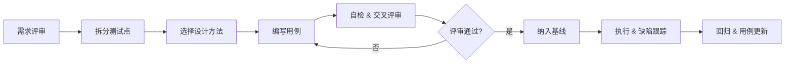

# 功能测试用例规范

> 本规范用于指导功能测试用例的编写、评审、维护与执行，覆盖 Web / App / 后端服务等以"功能正确性"为目标的测试场景。

## 1. 文档目的与适用范围

### 1.1 目的
- 统一团队对"测试用例"的理解，降低沟通成本。
- 保证用例具备 **可执行、可追溯、可维护** 三个基本属性。
- 为用例评审、覆盖率度量、缺陷定位提供共同基线。

### 1.2 适用范围

| 适用对象 | 不适用对象 |
| --- | --- |
| 新功能需求（PRD / User Story） | 纯性能 / 安全 / 兼容性专项 |
| 已有功能的回归测试 | 探索性测试的临时记录 |
| 接口、配置项、业务流程变更 | 一次性脚本验证 |

### 1.3 术语
- **测试用例 (Test Case)**：为某个目标编写的输入、执行条件、预期结果的集合。
- **前置条件 (Precondition)**：执行用例前系统必须处于的状态。
- **测试步骤 (Test Step)**：执行用例的具体操作序列。
- **预期结果 (Expected Result)**：步骤执行后系统应呈现的确定性行为。

---

## 2. 编写核心原则

| # | 原则 | 反例 |
| --- | --- | --- |
| 1 | **原子性**：一条用例只验证一个检查点 | 一条用例同时验证登录、搜索、下单、支付 |
| 2 | **独立性**：用例之间不依赖执行顺序 | 用例 B 必须先跑用例 A 才能进入 |
| 3 | **可重复**：相同输入与环境下结果一致 | 用例执行结果依赖当前时间或随机数 |
| 4 | **可判定**：预期结果必须明确、可断言 | "界面应该显示正常" |
| 5 | **正反兼有**：覆盖正常流 + 异常流 + 边界 | 只写"输入合法值"用例 |
| 6 | **面向业务**：从用户或业务视角描述，不暴露内部实现 | "调用 orderService.create() 返回 0" |
| 7 | **语言一致**：使用统一术语，避免"提交 / 发送 / 确认"混用 | 同义动词在一份用例中混用 |

---

## 3. 测试用例结构

一条用例至少包含以下字段，缺失即视为不完整。

| 字段 | 是否必填 | 说明 | 示例 |
| --- | --- | --- | --- |
| 用例编号 (ID) | 必填 | 全局唯一，见 §4 | `LOGIN_001` |
| 用例标题 (Title) | 必填 | 一句话概括被测点，采用"对象 + 行为 + 条件"结构 | `使用正确账号密码登录成功` |
| 模块 / 特性 (Module) | 必填 | 所属功能模块 | `账号 / 登录` |
| 优先级 (Priority) | 必填 | P0 ~ P3，见 §5 | `P0` |
| 用例类型 (Type) | 必填 | 功能 / 异常 / 边界 / 权限 / 数据等 | `功能` |
| 前置条件 (Precondition) | 必填 | 环境、数据、账号、配置 | `已注册账号 test@x.com` |
| 测试数据 (Test Data) | 必填 | 用到的具体参数 | `username=test@x.com, pwd=Abcd1234` |
| 测试步骤 (Steps) | 必填 | 顺序化、可执行的操作 | 1. 打开登录页 ... |
| 预期结果 (Expected) | 必填 | 每一步或整体的确定性结果 | 跳转首页，导航栏显示用户名 |
| 关联需求 (Requirement) | 选填 | 关联的 PRD / Story 编号 | `REQ-1024` |
| 自动化标记 (Automation) | 选填 | 是否纳入自动化 | `Yes / No / Planned` |
| 编写人 / 时间 (Author/Date) | 必填 | 责任追溯 | `zhangsan / 2026-06-09` |
| 备注 (Note) | 选填 | 特殊说明，如环境差异 | `仅在 Chrome 130+ 验证` |

> **断言建议**：预期结果尽量包含"页面元素 + 文案 + 状态码 / 数据 + 跳转 / 反馈"四要素中可观察到的部分，避免笼统的"成功"。

---

## 4. 编号与命名规范

### 4.1 编号规则

```
[模块缩写]_[大类]_[序号]
   LOGIN     FUN      001
```

- **模块缩写**：3 ~ 6 位大写字母，团队词典统一登记，禁止临时造词。
- **大类**：固定枚举（`FUN` 功能、`EXC` 异常、`BND` 边界、`PER` 权限、`DAT` 数据、`INT` 集成、`UI` 界面）。
- **序号**：模块内 3 位数字，从 `001` 起连续递增，不重用。

### 4.2 标题规范
- 采用 **主语 + 场景 + 预期** 结构，长度 ≤ 30 字。
- 同一模块标题前缀应一致，便于聚合检索。
- 示例：
  - 正确：使用未注册手机号注册时提示"账号不存在"
  - 错误：注册失败（信息不足）

### 4.3 文件 / 表格组织
- 推荐按模块分 Sheet / 文件，便于多人协作。
- 评审通过后冻结基线，变更走"用例变更单"流程。

---

## 5. 优先级与严重程度

### 5.1 优先级（执行顺序）

| 级别 | 含义 | 覆盖要求 |
| --- | --- | --- |
| P0 | 阻塞主流程 / 核心功能 | 每次发布前 100% 执行 |
| P1 | 主要业务分支 | 每次发布前 100% 执行 |
| P2 | 次要功能 / 异常分支 | 回归抽样 100% |
| P3 | 边角、易复现的低影响场景 | 回归抽样 ≥ 30% |

> **优先级 ≠ 严重程度**：优先级决定"什么时候跑"，严重程度决定"出 bug 后影响多大"。

### 5.2 严重程度（缺陷分级，配套使用）

| 级别 | 描述 |
| --- | --- |
| S1 | 系统不可用 / 主流程断裂 / 数据损坏 |
| S2 | 主要功能不可用，但有 workaround |
| S3 | 次要功能异常或体验问题 |
| S4 | 提示、样式、文案等小瑕疵 |

---

## 6. 用例设计方法

按场景灵活组合以下方法，避免机械罗列。

| 方法 | 适用场景 | 设计要点 |
| --- | --- | --- |
| **等价类划分** | 输入域较大 | 划分有效 / 无效等价类，每类至少 1 条用例 |
| **边界值分析** | 数值、长度、范围 | 取 `min`、`min-1`、`max`、`max+1`、刚好等于 |
| **判定表 / 因果图** | 多条件组合 | 列出所有条件组合并精简为规则 |
| **状态迁移** | 有明确状态机 | 覆盖每条状态转移 + 非法转移 |
| **场景法** | 业务流程 | 覆盖主成功流 + 备选流 + 异常流 |
| **错误猜测** | 经验型补充 | 记录经验缺陷库，避免遗漏 |
| **配对 / 正交** | 多参数组合爆炸 | 用 Pairwise 工具生成最小集 |

> **必备场景检查表**（任何需求都应过一遍）：
> - [ ] 正常主流程
> - [ ] 必填项校验（每个必填项各 1 条）
> - [ ] 长度 / 格式 / 类型校验
> - [ ] 权限（未登录 / 越权 / 角色）
> - [ ] 并发 / 重复提交
> - [ ] 网络 / 服务异常降级
> - [ ] 数据依赖（外键、级联、删除）

---

## 7. 覆盖维度

一条完整的功能测试集应覆盖以下维度。

1. **功能正确性**：业务逻辑、计算公式、状态流转。
2. **数据校验**：必填、格式、长度、范围、唯一性、字符注入。
3. **权限控制**：登录态、角色、数据可见性。
4. **流程贯通**：跨模块端到端路径。
5. **异常处理**：超时、断网、并发、幂等、补偿。
6. **兼容性 / 跨端**：浏览器、设备、系统版本（按 §1 适用范围决定深度）。
7. **UI / 交互**：控件可用性、文案、提示、键盘可达性（轻量级）。
8. **配置 / 开关**：Feature Flag、灰度策略、AB 分桶。
9. **数据初始化 / 清理**：测试数据准备、跑后清理。

---

## 8. 编写流程



### 8.1 评审 Checklist
- [ ] 标题明确、动词一致、无歧义。
- [ ] 前置条件可复现，测试数据具体到值。
- [ ] 步骤 ≤ 7 步，超出则拆分。
- [ ] 预期结果有可观察证据（元素 / 文案 / 状态 / 数据）。
- [ ] 覆盖了正向 + 逆向 + 边界 + 权限。
- [ ] 编号、优先级、用例类型准确。
- [ ] 与自动化用例库无重复（已自动化的用例不再手写）。
- [ ] 与需求变更同步，无陈旧用例。

---

## 9. 维护与版本管理

| 场景 | 处理方式 |
| --- | --- |
| 需求变更 | 需求确定后 1 个工作日内更新用例 |
| 缺陷遗漏 | 缺陷修复后 24h 内补成回归用例 |
| 用例失效 | 标记 `Deprecated` 并说明废弃原因 |
| 历史归档 | 每发布一个版本做一次基线快照 |
| 责任划分 | 用例作者负责首次创建，模块 Owner 负责长期维护 |

> **删除原则**：禁止直接删除历史用例，统一改为标记 `Deprecated`，保留可追溯性。

---

## 10. 输出模板

### 10.1 Markdown 模板（适合 PR / 文档）

```markdown
### 登录 - 正常登录
- **用例编号**: LOGIN_FUN_001
- **模块**: 账号 / 登录
- **优先级**: P0
- **用例类型**: 功能
- **前置条件**:
  1. 已注册账号 test@x.com，密码 Abcd1234
  2. 账号处于正常状态，未被锁定
- **测试数据**:
  - 用户名: test@x.com
  - 密码: Abcd1234
  - 验证码: 0000（测试环境固定）
- **测试步骤**:
  1. 打开登录页（示例域名）
  2. 在"账号"输入框填入 test@x.com
  3. 在"密码"输入框填入 Abcd1234
  4. 点击【登录】按钮
- **预期结果**:
  1. 页面跳转到首页
  2. 右上角显示用户名 test@x.com
  3. 接口返回 200，body 含 token 字段
- **关联需求**: REQ-1024
- **自动化标记**: Yes
```

### 10.2 表格模板（适合 Excel / 在线表格）

| 用例编号 | 标题 | 模块 | 优先级 | 类型 | 前置条件 | 测试数据 | 测试步骤 | 预期结果 | 关联需求 | 自动化 | 编写人 | 备注 |
| --- | --- | --- | --- | --- | --- | --- | --- | --- | --- | --- | --- | --- |
| LOGIN_FUN_001 | 使用正确账号密码登录成功 | 登录 | P0 | 功能 | 已注册账号 test@x.com | user=test@x.com / pwd=Abcd1234 | 1.打开登录页 2.输入账号 3.输入密码 4.点击登录 | 跳转首页，显示用户名，接口 200 | REQ-1024 | Yes | zhangsan |  |

### 10.3 脑图模板（适合快速梳理）

```
登录
├── 正常流
│   ├── 账号密码正确登录成功
│   └── 记住登录态 7 天有效
├── 异常流
│   ├── 账号不存在
│   ├── 密码错误
│   ├── 账号被锁定
│   └── 验证码错误
└── 边界 / 权限
    ├── 密码长度边界 (8/16/32)
    ├── 特殊字符注入
    └── 未登录访问受保护页面
```

---

## 11. 常见反模式

| 反模式 | 风险 | 推荐做法 |
| --- | --- | --- |
| 把"用例"写成"剧本" | 步骤冗长、维护困难 | 拆步骤、提取公共前置条件 |
| 预期结果写"正确" | 无法判定通过 / 失败 | 落到具体元素、文案、状态 |
| 一条用例覆盖整个模块 | 失败后无法定位 | 按检查点拆分 |
| 只写正向用例 | 异常路径遗漏 | 强制 1:1 配对 |
| 用例与需求脱节 | 变更不同步 | 强制关联需求 ID |
| 过度依赖 GUI 描述 | 兼容性差时维护成本高 | 关键断言下沉到接口 / 数据 |

---

## 12. 附录

### 附录 A：模块缩写词典（示例）

| 模块 | 缩写 |
| --- | --- |
| 账号 / 登录 / 注册 | LOGIN / REG |
| 订单 | ORDER |
| 支付 | PAY |
| 商品 | PROD |
| 库存 | STOCK |
| 营销 / 优惠 | MKT |
| 消息 / 通知 | MSG |

### 附录 B：用例自检 5 问
1. 任意一位团队成员不看代码就能执行吗？
2. 执行结果在 5 秒内可断言吗？
3. 失败时能直接定位到具体被测点吗？
4. 修改需求后能在 5 分钟内更新完毕吗？
5. 自动化脚本可以直接基于步骤和预期生成吗？

> 5 问全部为"是"，视为合格用例。
